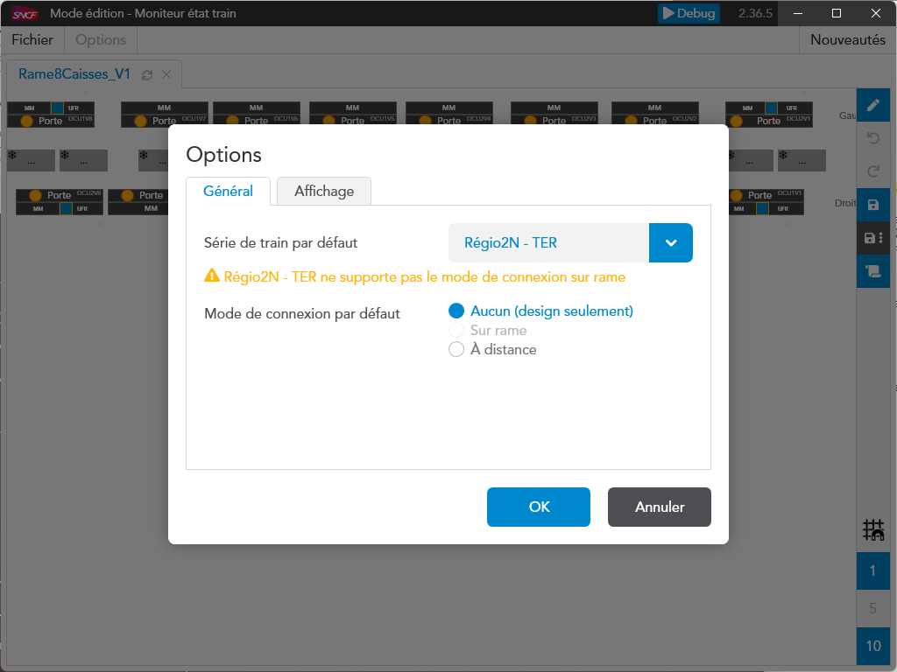
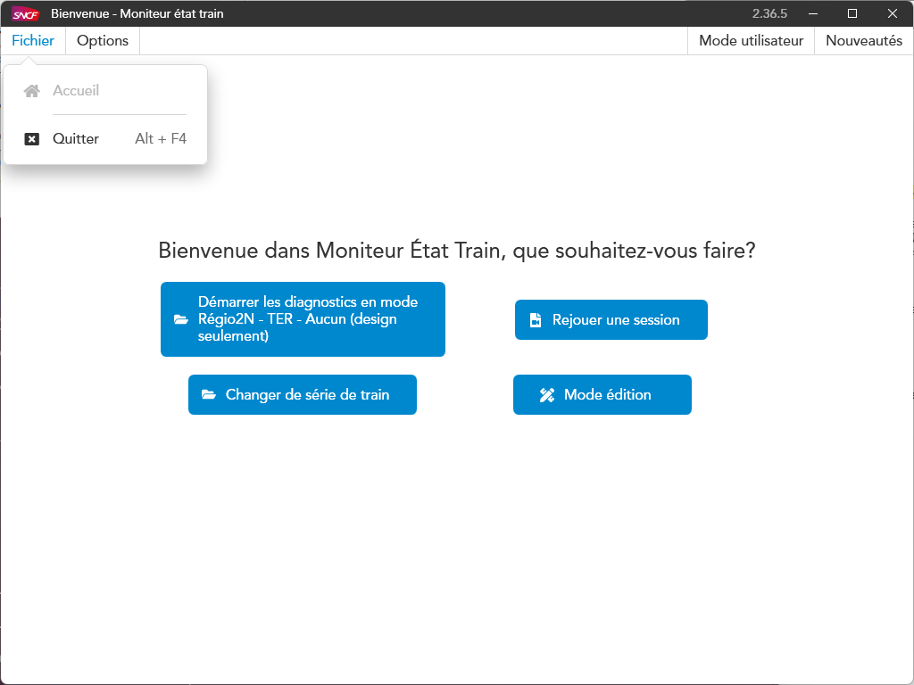
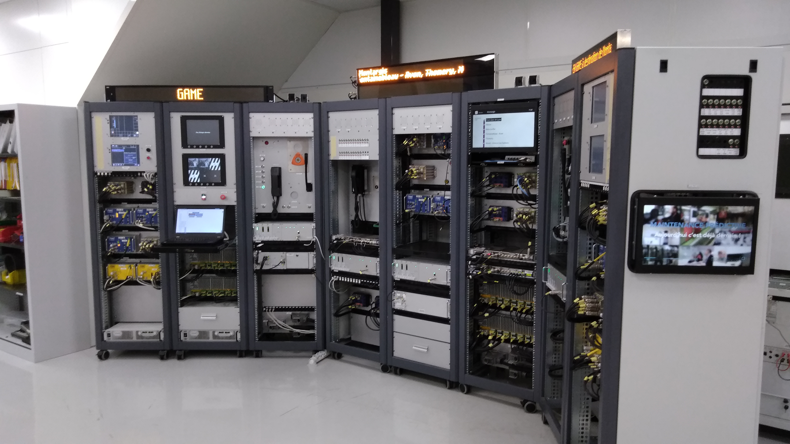
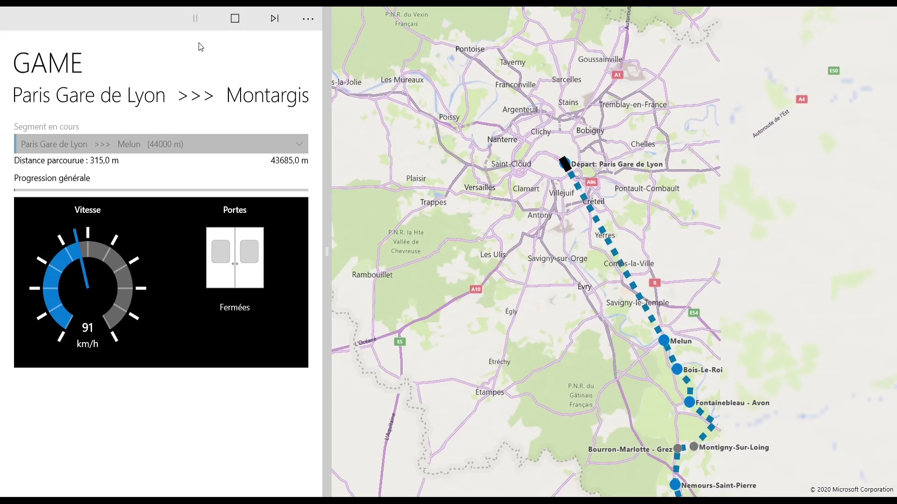
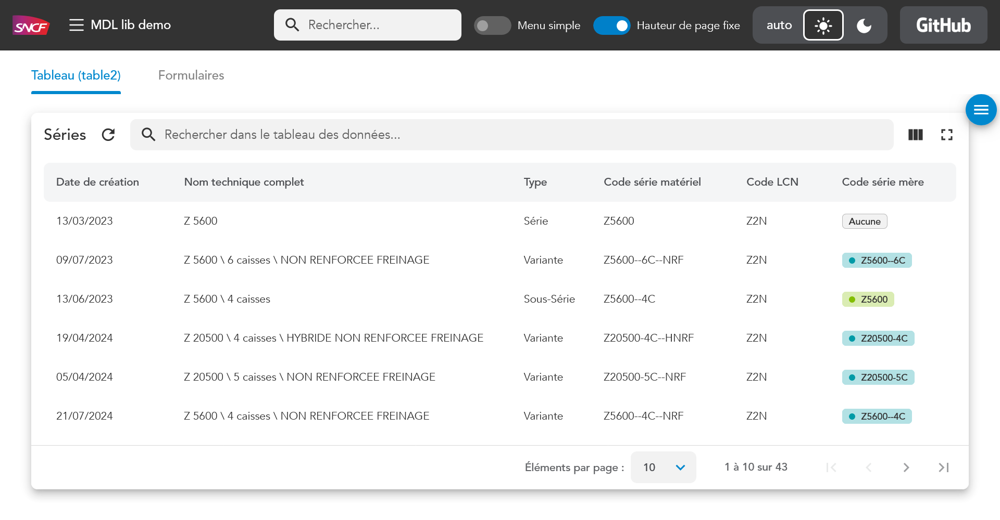

# Hello and welcome to my profile!

French developer living in Tours, France and working for https://masteris.com[MASTERIS], a subsidiary of SNCF dedicated to sharing SNCF's experience to other companies.

## About me

Here are some languages/techs I'm familiar with :

- French and English : I'm fluent in both, you can have me in your meeting, I won't embarass you, I promise.
- *Web frontends (Angular/HTML/TailwindCSS/daisyUI/MaterialUI) : my current tech stack at work*. I'm the go-to guy for all UI/UX/CSS questions at my office. See <<mdl-angular-lib>> below for reference.
- https://thingsboard.io[Thingsboard] and AWS : we use this kind of tech stack at MASTERIS as a base for rapid project prototyping and/or small projects.
- C# (.NET, WPF, Blazor) : my other well known stack, more for my legacy or CLI-only projects, I worked daily for 5+ years on all C# things, in pseudo realtime projects, involving custom networking over UDP.
- Cross-language compatibility : I used to do a lot of this. Wrapping libs manually using P/Invoke with C#, or "automatically" using the https://github.com/swig/swig[SWIG] project to make python programs talk to a C++ library for example.
- Docker, AWS, git, etc : I'm not a devops but I'll find my way around if needed.
- C, C++ (for programming multicontrollers or similar environments) : I know what a pointer or a segfault is, however I haven't touched it for a long time.
- Qt : I did a bit of Qml for my end of studies project in the school year 2016-2017, https://github.com/ThomasPrioul/turntable)[you can about read it in my Turntable repository].

## Closed-source portfolio

Here I will present some of my work for SNCF/Masteris (without disclosing anything sensible, of course).

[%hardbreaks]
<<SNCF WPF theme>>
<<TCMS testing benches>>

### SNCF WPF theme

[%hardbreaks]
Custom theme made throughout my time as an apprentice at SNCF for my C# apps (WPF).
It ran fine on Windows XP!

### TCMS testing benches

[%hardbreaks]
My first 4 years at SNCF, first as an apprentice and then a consultant, was about implementing the software of two testing benches for TCMS networks (Train Control and Management System) for the Z50000 and Z57000/Z55500 train series.

These testing benches allow us to validate the behavior of train devices, before/after repair and also after modifying/updating their firmware/software.

My job there consisted of simulating all devices which weren't actually on the bench over their respective networks (IPTCom, MVB) to make the TCMS work as it should.

This involved different programs in a client/server architecture in C#, as well as programming some gateway devices in C for a FPGA (for MVB network).

I was working on this project with two colleagues, a system expert who oversaw the project and an electronics expert who designed and assembled the bench itself.

Here is a photo of the Z57000 bench for reference.

Later, the program added the possibility to simulate missions to make the Passenger Information System (PIS) play its storyboard (sound announcements and texts on screens).

## Open-source portfolio

Here are some of my publicly available demo apps and libraries.

### https://github.com/ThomasPrioul/mdl-angular-libs[MDL angular lib]

The reusable angular components developed for my team at SNCF's Cluster Ingenierie Ouest (Tours - France).
It consists of a set of useful directives, but especially of my own flavor of Google's Material UI library, with CSS overrides to comply to SNCF's 2023/2024 design system.

[frame=none, grid=none]
|===
a|[link=https://github.com/ThomasPrioul/mdl-angular-libs/releases/]
image::https://img.shields.io/github/release/ThomasPrioul/mdl-angular-libs?include_prereleases=&sort=semver&color=blue[GitHub release] a|[link=https://npmjs.com/package/mdl-angular]
image::https://img.shields.io/badge/npm-mdl--angular-2ea44f[npm - mdl-angular] a| 
https://thomasprioul.github.io/mdl-angular-libs/[Demo available here!]
|===

.MDL angular demo screenshot

Also contains custom made controls such as tree-hierarchy selects, with search bar.

.Tree select with filter
image::https://github.com/ThomasPrioul/mdl-angular-libs/raw/main/screenshots/mdl-tree-select.png[Tree with filter]

And a double paned calendar.

.Double paned calendar in date picker
image::https://github.com/ThomasPrioul/mdl-angular-libs/raw/main/screenshots/mdl-date-picker.png[Date picker]

### https://github.com/ThomasPrioul/Turntable[End of studies school project (2017) - Raspberry Pi touch controlled turntable railway model]

ifdef::env-github[]
image:https://img.youtube.com/vi/3iFZytrDC-M/maxresdefault.jpg[link=https://youtu.be/3iFZytrDC-M]
endif::[]

ifndef::env-github[]
video::3iFZytrDC-M[youtube]
endif::[]

### https://github.com/ThomasPrioul/CV[2018 CV as an app]

[%hardbreaks]
My 2018 CV as an executable app (single EXE file - unsigned so windows smartscreen will warn you).  
Made with C#/WPF.  
Uses custom Windows Shell integration, with a print button in the "system bar".  
Somewhat responsive to greater window sizes.  

link:https://github.com/ThomasPrioul/CV/releases/download/1.0/CV.exe[Download]

.CV screenshot
image::https://github.com/ThomasPrioul/CV/raw/master/cv.png[cv screenshot]

